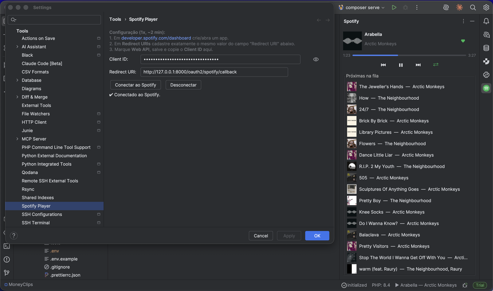

# Spotify Player — plugin universal para IDEs JetBrains

Controle o Spotify sem sair da sua IDE JetBrains. Uma *tool window* na barra direita mostra
a música atual com capa e barra de progresso, controles de reprodução, modo aleatório, a fila
de reprodução em tempo real e permite favoritar/remover músicas. A faixa atual também aparece
na barra de status.

Funciona em **qualquer IDE JetBrains** baseada na plataforma IntelliJ (IntelliJ IDEA, PhpStorm,
WebStorm, PyCharm, GoLand, RubyMine, CLion, Rider…), pois depende apenas de
`com.intellij.modules.platform`.



## Recursos

- 🎵 Música atual com capa, título, artista e barra de progresso
- ⏮ ▶⏸ ⏭ Play / pause, próxima e anterior
- ⇄ Modo aleatório (liga/desliga; detecta também a ordem aleatória inteligente)
- 📜 Fila de reprodução em tempo real, com capa de cada faixa
- ▶ Clicar numa faixa da fila toca ela (mantendo o contexto/fila)
- ♥ Favoritar / remover músicas (Liked Songs), no header e no menu de contexto da fila
- 🔽 Música atual na barra de status (clique abre o player)

## Requisitos

- Uma IDE JetBrains **2026.1+** (build 261+)
- **JDK 21** (para compilar)
- Conta Spotify — controles de reprodução e fila exigem **Spotify Premium** (limitação da API)

## Build

O projeto compila contra uma IDE JetBrains já instalada na sua máquina (evita baixar ~1 GB de SDK).
Por padrão ele procura `~/Applications/PhpStorm.app`. Para apontar para outra IDE, use a
propriedade `localIdePath`:

```bash
# usando o padrão (~/Applications/PhpStorm.app)
./gradlew buildPlugin

# apontando para outra IDE instalada
./gradlew buildPlugin -PlocalIdePath="/Applications/IntelliJ IDEA.app"
```

O artefato instalável é gerado em:

```
build/distributions/edsuuu-1.0.0.zip
```

Outros comandos úteis:

```bash
./gradlew test      # roda os testes
./gradlew runIde    # abre uma IDE-sandbox com o plugin já instalado
```

Para o `runIde` abrir um projeto específico, passe `-PrunProjectPath=/caminho/do/projeto`.

## Instalação manual

1. Gere (ou baixe) o arquivo `edsuuu-1.0.0.zip`.
2. Na IDE: **Settings/Preferences → Plugins → ⚙ (engrenagem) → Install Plugin from Disk…**
3. Selecione o `.zip` e confirme.
4. Reinicie a IDE quando solicitado.

Alternativa por linha de comando (com a IDE fechada), descompactando na pasta de plugins:

```bash
# exemplo para PhpStorm 2026.1 no macOS
unzip -o build/distributions/edsuuu-1.0.0.zip \
  -d "$HOME/Library/Application Support/JetBrains/PhpStorm2026.1/plugins"
```

As pastas de plugins por sistema operacional:

- **macOS**: `~/Library/Application Support/JetBrains/<IDE><versão>/plugins`
- **Linux**: `~/.local/share/JetBrains/<IDE><versão>/plugins`
- **Windows**: `%APPDATA%\JetBrains\<IDE><versão>\plugins`

## Configuração inicial (uma vez, ~2 min)

O plugin usa **o seu próprio app** do Spotify (fluxo OAuth *Authorization Code + PKCE*, sem
client secret):

1. Acesse <https://developer.spotify.com/dashboard> e clique **Create app**.
2. Nome/descrição: qualquer coisa (ex.: `IDE Player`).
3. Em **Redirect URIs**, adicione **exatamente**:
   ```
   http://127.0.0.1:8888/callback
   ```
4. Marque **Web API** e salve.
5. Copie o **Client ID**.
6. Na IDE: **Settings → Tools → Spotify Player**, cole o Client ID e clique
   **Conectar ao Spotify**. Autorize no navegador — pronto.

O *refresh token* fica guardado no cofre seguro da IDE (PasswordSafe). O Client ID não é
secreto e fica nas configurações (o campo é mascarado, com um olho para revelar).

## Como funciona

- **OAuth PKCE** com um servidor de callback local temporário na porta do Redirect URI.
- O access token fica só em memória e é renovado automaticamente pelo refresh token.
- A tool window faz *polling* da Web API do Spotify a cada 1s (estado) e a cada ~3s (fila).
- As URLs da API ficam em [`spotify.properties`](src/main/resources/spotify.properties).

## Escopos usados

`user-read-playback-state`, `user-modify-playback-state`, `user-read-currently-playing`,
`user-library-read`, `user-library-modify`.

## Limitações conhecidas

- Play/pause/próxima/anterior e a fila exigem **Spotify Premium** e um dispositivo ativo.
- A porta de callback vem do Redirect URI (padrão `8888`). Se estiver ocupada, o login falha com aviso.
- A Web API do Spotify não permite **ativar** a ordem aleatória inteligente de fora do app oficial;
  o plugin apenas a detecta e liga/desliga o aleatório comum.

## Licença

MIT.
